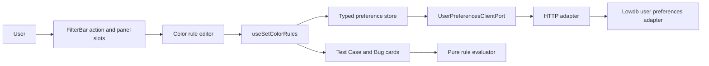

# Color coding

Approved behavior: [contract v1](../contracts/color-coding.v1.html), independently reviewed [traceability](../contracts/color-coding.v1.traceability.md). The contract checksum is checked against its approved hash as well as its file; the reviewed test manifest is pinned separately.

## Use

Each column has a palette icon immediately after its filter icon. Both editors start collapsed. Each rule has one field, comparison, literal value and color. Title supports Contains, Does not contain, Starts with and Equals; State and whole Tag support Equals. First match wins. Empty values do not match. Collapsing an editor retains both rules and applied colors.

Rules are personal to the active Set. The Bug list only applies to Bug cards. The four theme-aware colors tint the card and add a rail; status/outcome chips and relation conflict styling remain independent. The applied rule is exposed in the card tooltip and accessible description.

## C4 component view

- `src/domain/color-coding/color-rule.ts`: ordered single-predicate matching, without UI or persistence dependencies.
- `src/features/color-coding/`: row editor, immediate card-style color preview, independent disclosure state and per-Set preference state. FilterBar accepts generic action/panel slots; filtering does not depend on color coding.
- `src/shared/user-preferences/color-rule-preference.ts`: validation and persistence shape. `setColorRules[setId]` holds separate `testCases` and legacy-named `bugs` arrays. The latter now applies to all queried Work Item types so existing Bug rules migrate without data loss. Empty arrays intentionally clear rules; invalid input is excluded. Open/closed state is transient.
- `src/shared/color-coding/color-rule-description.ts`: shared readable explanation for both card types.
- Existing HTTP and lowdb adapters merge the new keyed preference branch without overwriting other Sets. The HTTP write/recovery queue includes the branch in late-write reconciliation.
- Existing application preference error handling surfaces failed saves. lowdb remains authoritative; localStorage is the existing fallback only.

## Verification

`node scripts/check-color-coding-approval.mjs` checks the approved contract, exact checksum and reviewed test manifest. Unit tests cover rule evaluation and sanitizing. The browser contract tests use real rendering, the real HTTP preference adapter and a temporary lowdb file, covering all CC-01–CC-14 requirements. No fixture data is added to the application or user preferences.

The `Color coding contract` workflow runs on the existing self-hosted runners for relevant pull requests and integration-branch pushes. Same-PR superseded runs are cancelled. General unit/regression gates remain in the existing workflow.
