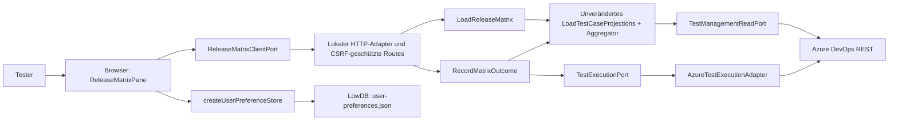

# Release-Matrix

Die verbindliche Funktionsreferenz ist der [freigegebene Vertrag](../contracts/release-matrix.v1.html). Diese technische Übersicht erweitert ihn nicht.

## Bedienung

Im bestehenden Set zur „Release-Matrix“ wechseln. Unter „Spalten & Gruppierung“ die feste Stammsuite auswählen und je Version/Umgebung eine Spalte mit Namen, vollständigem Versions-Tag und Release-Wurzel hinzufügen. Gleichnamige fachliche Suites werden nebeneinander ausgerichtet. Mehrdeutige oder entfernte Zuordnungen erfordern die Auswahl einer konkreten Suite. Die Konfiguration zeigt deren Pfad und ID.

Alternativ zur Gruppierung nach Suites kann eine eigene geordnete Tag-Liste verwendet werden. Die direkte Suite-Mitgliedschaft, ein vollständiger Tag und die Suche nach ID/Titel lassen sich kombinieren. Diese Filter bestimmen sichtbare Testfall-IDs; sie verändern keine Ergebnisquelle.

Status-Chips entsprechen der Zuordnung. Ein Klick öffnet die vollständige Outcome-Auswahl. Pfeiltasten wählen einen Wert, Enter bestätigt und Escape verwirft die Tastaturauswahl. Nur genau ein Testpunkt erlaubt das Schreiben. Nach der Auswahl entsteht ein neuer manueller Durchlauf; vorherige Resultate bleiben erhalten. Bei einem Fehler nach Erzeugung nennt die Meldung dessen ID. Vor einer erneuten Auswahl diesen Durchlauf in Azure prüfen.

„Matrix aktualisieren“ lädt den aktuellen Datenstand. Beim Wechsel zurück zur Zuordnung zeigt deren bestehende Aktualisierung denselben bestätigten Outcome.

Schlägt das Nachladen fehl, bleibt ein vorhandener Datenstand ausdrücklich als veraltet gekennzeichnet und für weitere Ergebnisänderungen gesperrt. Erst eine erfolgreiche Aktualisierung hebt die Sperre auf. Beim Ansichtswechsel bleiben laufende Verknüpfungsänderungen und ihre Rückmeldungen in der Zuordnung erhalten.

## C4: Container und Komponenten



- Domain: `matrix-config.ts` enthält Konfiguration, Sanitizing und erlaubte manuelle Outcomes. Der bestehende Outcome-Aggregator bleibt unverändert.
- Application: Der Matrix-Lader verwendet die bestehende Projektion je Testfall/Suite. Der Schreib-Use-Case validiert Mitgliedschaft und genau einen physischen Testpunkt, erzeugt einen Run, schließt Resultat und Run ab und prüft anschließend Run-ID, Resultat-ID, Outcome und Suite/Testfall über den vorhandenen Lesepfad.
- Adapter: Der neue Azure-Schreibadapter verwendet JSON für Test-Resultate/Runs. Relation-Patches behalten ihr bisheriges JSON-Patch-Format. Nicht-idempotente Run-Erzeugungen werden nicht automatisch wiederholt.
- HTTP: Die Route erfasst den Set-/Projektkontext einmal pro Anfrage. Schreibanfragen müssen zusätzlich den Kontext des geladenen Datenstands bestätigen; ein inzwischen geänderter Kontext wird vor dem Azure-Zugriff abgewiesen. Eine Sperre verhindert gleichzeitige Writes auf denselben Testpunkt im lokalen Server.
- UI: Hooks verwalten flüchtigen Ladezustand; ein nach Set, Plan und Kontext getrennter In-Memory-Store erhält laufende Schreibvorgänge und deren Rückmeldungen über Ansichtswechsel hinweg. Bestätigte Änderungen lösen einen erneuten Lesevorgang aus. Darstellungsfunktionen richten vorhandene Projektionen aus; physische Suite-IDs bleiben auch bei mehrfacher Tag-Darstellung erhalten.

## Persistenz

`setReleaseMatrices[setId]` speichert ausschließlich die Konfiguration. Der vorhandene Präferenzadapter übernimmt sanitisiertes, pro Set zusammengeführtes Speichern und Wiederherstellen. `localStorage` bleibt Fallback. Run-IDs, Ergebnisse, Fehlermeldungen und Pending-Zustände werden nicht als Nutzerpräferenz gespeichert.

## Prüfung

```sh
node scripts/check-release-matrix-approval.mjs
npm run typecheck
npm run check:cycles
npm run test:coverage
npm run build
npm run test:e2e -- tests/e2e/release-matrix
```

Die eingefrorenen 22 E2E-Tests starten den echten lokalen Server, die echten Adapter und die echte Browseroberfläche mit isoliertem LowDB-Verzeichnis. Lediglich die Azure-HTTP-Grenze wird im Test-Harness simuliert. Sie führen keine Writes in einem Azure-Kundenprojekt aus. Zusätzliche Unit-Tests prüfen Zielvalidierung, Aggregator-Wiederverwendung und Präferenz-Isolierung. Testdateien und Vertrag werden über eingecheckte Prüfsummen validiert.

Das Coverage-Gate verlangt mindestens 80 Prozent für Zeilen, Statements und Funktionen. Ein Sonar-Rating wird durch dieses lokale Gate nicht gemessen.
