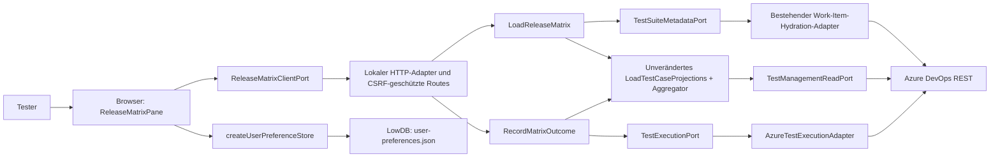

# Release-Matrix

Die verbindliche Funktionsreferenz ist der [freigegebene Vertrag v2](../contracts/release-matrix.v2.html). Diese technische Übersicht erweitert ihn nicht.

## Bedienung

Im bestehenden Set zur „Release-Matrix“ wechseln. Unter „Spalten & Gruppierung“ die Stammsuite als Testkatalog auswählen; ihr Unterbaum darf auch den gesamten Plan umfassen. Je Version/Umgebung eine Spalte mit Namen und vollständigem Suite-Tag hinzufügen. Der Tag muss auf dem konkreten Suite-Work-Item stehen. Testfall-Tags, Query-Ausdrücke und Tags übergeordneter Suites bestimmen keine Ergebnisquelle.

Jeder Testfall erscheint pro exakt gleichem fachlichem Suite-Namen einmal, auch wenn er in mehreren Release-Suites vorkommt. Verschiedene Namen bleiben getrennte Gruppen. Die Quelle einer Spalte wird planweit über den exakten Namen und den vollständigen Suite-Tag bestimmt; Groß-/Kleinschreibung und äußere Leerzeichen des Tags werden ignoriert. Ein leerer Spaltentag bleibt unkonfiguriert. Mehrere unterschiedliche Suites mit demselben Namen und Spaltentag erfordern eine explizite Auswahl. Die Konfiguration zeigt Pfad, ID und Tag der Quelle.

Eine explizite Auswahl bleibt bei einer Quellenumbenennung an die Suite-ID gebunden. Nach Tagentfernung oder Planwechsel wird sie ungültig und nicht automatisch ersetzt. Trägt dieselbe konkrete Suite mehrere Spaltentags, können mehrere Anzeigen denselben physischen Testpunkt zeigen; bestätigte Änderungen erscheinen in genau diesen Anzeigen gemeinsam.

Alternativ zur Gruppierung nach fachlichen Suite-Namen kann eine eigene geordnete Liste von Testfall-Tags verwendet werden. Die direkte Suite-Mitgliedschaft, ein vollständiger Testfall-Tag und die Suche nach ID/Titel lassen sich kombinieren. Diese Filter bestimmen sichtbare logische Zeilen; sie verändern keine Ergebnisquelle. Wiederholte Zeilen im Tagmodus nennen die fachliche Gruppe; konkrete Quellenpfade stehen in Konfiguration und Tooltip.

Status-Chips entsprechen der Zuordnung. Ein Klick öffnet die vollständige Outcome-Auswahl. Pfeiltasten wählen einen Wert, Enter bestätigt und Escape verwirft die Tastaturauswahl. Nur genau ein Testpunkt erlaubt das Schreiben. Nach der Auswahl entsteht ein neuer manueller Durchlauf; vorherige Resultate bleiben erhalten. Bei einem Fehler nach Erzeugung nennt die Meldung dessen ID. Vor einer erneuten Auswahl diesen Durchlauf in Azure prüfen.

„Matrix aktualisieren“ lädt den aktuellen Datenstand. Beim Wechsel zurück zur Zuordnung zeigt deren bestehende Aktualisierung denselben bestätigten Outcome.

Schlägt das Nachladen fehl, bleibt ein vorhandener Datenstand ausdrücklich als veraltet gekennzeichnet und für weitere Ergebnisänderungen gesperrt. Erst eine erfolgreiche Aktualisierung hebt die Sperre auf. Beim Ansichtswechsel bleiben laufende Verknüpfungsänderungen und ihre Rückmeldungen in der Zuordnung erhalten.

## C4: Container und Komponenten



- Domain: `matrix-config.ts` enthält Konfiguration, Sanitizing und erlaubte manuelle Outcomes. Der bestehende Outcome-Aggregator bleibt unverändert.
- Application: Der Matrix-Lader verwendet die bestehende Projektion je Testfall/Suite. Ein eigener Suite-Metadaten-Port liefert Tags für sämtliche angefragten Suite-IDs oder lehnt den Read vollständig ab. Fehlende Work Items, falsche Work-Item-Typen und Transportfehler werden nicht als ungetaggte Suites behandelt. Der Schreib-Use-Case validiert Mitgliedschaft und genau einen physischen Testpunkt, erzeugt einen Run, schließt Resultat und Run ab und prüft anschließend Run-ID, Resultat-ID, Outcome und Suite/Testfall über den vorhandenen Lesepfad.
- Adapter: Der neue Azure-Schreibadapter verwendet JSON für Test-Resultate/Runs. Relation-Patches behalten ihr bisheriges JSON-Patch-Format. Nicht-idempotente Run-Erzeugungen werden nicht automatisch wiederholt.
- HTTP: Die Route erfasst den Set-/Projektkontext einmal pro Anfrage. Schreibanfragen müssen zusätzlich den Kontext des geladenen Datenstands bestätigen; ein inzwischen geänderter Kontext wird vor dem Azure-Zugriff abgewiesen. Eine Sperre verhindert gleichzeitige Writes auf denselben Testpunkt im lokalen Server.
- UI: Hooks verwalten flüchtigen Ladezustand; ein nach Set, Plan und Kontext getrennter In-Memory-Store erhält laufende Schreibvorgänge und deren Rückmeldungen über Ansichtswechsel hinweg. Bestätigte Änderungen lösen einen erneuten Lesevorgang aus. Darstellungsfunktionen bilden logische Zeilen aus dem Tupel von fachlichem Suite-Namen und Testfall-ID. Die ausgewählte Ergebnisprojektion sowie Writes bleiben an die reale physische Suite und ihren Testpunkt gebunden.

## Persistenz

`setReleaseMatrices[setId]` speichert ausschließlich die Konfiguration. Der vorhandene Präferenzadapter übernimmt sanitisiertes, pro Set zusammengeführtes Speichern und Wiederherstellen. `localStorage` bleibt Fallback. Run-IDs, Ergebnisse, Fehlermeldungen und Pending-Zustände werden nicht als Nutzerpräferenz gespeichert.

Einklappzustände bleiben je Gruppierungsmodus getrennt: `collapsed` enthält fachliche Suite-Namen, `collapsedTags` die Taggruppen-IDs. Dadurch beeinflussen auch Suite-Namen wie `untagged` oder `tag:smoke` keine gleichlautenden Taggruppen.

Die Konfiguration trägt `version: 2`. Beim Umstieg aus v1 bleiben Katalogbasis, Darstellungsmodus, Spaltennamen, Umgebungen, Tags, Reihenfolge/Sichtbarkeit der Spalten und Filter erhalten. Alte Release-Wurzeln entfallen als Quellenbeschränkung. Physische v1-Zuordnungen werden verworfen; Quellen werden nach den v2-Regeln neu aufgelöst. Gruppenreihenfolge und eingeklappte Gruppen werden auf die alphabetische Standarddarstellung mit offenen Gruppen zurückgesetzt. Ein Hinweis erklärt diesen Umstieg. Die Herkunft `migratedFrom: 1` bleibt bei wiederholtem Sanitizing erhalten, sodass serverseitige und browserseitige Verarbeitung dieselbe Migration nicht unterschiedlich ausführen. Neue explizite Zuordnungen verwenden das Tupel von fachlichem Namen und Spalten-ID; ungültige v2-Zuordnungen bleiben sichtbar ungültig.

## Prüfung

```sh
node scripts/check-release-matrix-approval.mjs
npm run typecheck
npm run check:cycles
npm run test:coverage
npm run build
npm run test:e2e -- tests/e2e/release-matrix
```

Die 38 v2-Vertragsszenarien starten den echten lokalen Server, die echten Adapter und die echte Browseroberfläche mit isoliertem LowDB-Verzeichnis. Lediglich die Azure-HTTP-Grenze wird im Test-Harness simuliert. Sie führen keine Writes in einem Azure-Kundenprojekt aus. Die eingefrorenen v1-Szenarien bleiben historische Artefakte; ihre abgelöste Suite-Wurzel-Semantik wird nicht mehr als aktive Produktreferenz ausgeführt. Die zusätzliche Scrollregression bleibt aktiv. Unit-Tests prüfen unter anderem Suite-Metadatenvalidierung, logische Zeilen, Zielvalidierung, Aggregator-Wiederverwendung und Präferenzmigration/-Isolierung. Testdateien und Vertrag werden über eingecheckte Prüfsummen validiert.

Das Coverage-Gate verlangt mindestens 80 Prozent für Zeilen, Statements und Funktionen. Ein Sonar-Rating wird durch dieses lokale Gate nicht gemessen.

## Diagnose lang laufender Matrix-Reads

Browserkonsole und lokales Server-Terminal protokollieren `[release-matrix.read]` mit derselben zufälligen `requestId` (Header `x-matrix-request-id`). Der Server übernimmt nur gültige UUID-v4-Werte; sonst erzeugt er selbst eine neue ID. Die Logs enthalten keine Testtitel, Ergebnisinhalte, URLs, Kontextnamen, Tokens oder Authentifizierungsheader.

- `start`: Request begonnen; `side` unterscheidet Browser und Server.
- `progress`: Plan-ID und Zähler, unter anderem `catalogSuiteCount`, `candidateRootCount`, `missingParentCount`, `duplicateCatalogSuiteIdCount`, `canonicalRootCount`, `skippedOverlappingRoots`, `overlappingSuiteCount`, `duplicateSuiteIdCount`, Suite-/Projektions-/Point-Anzahlen. `missingParentCount` zählt Katalogeinträge ohne im Katalog auflösbaren Elternverweis (einschließlich regulärer Roots).
- `pending`: alle zehn Sekunden Laufzeit, abgeschlossene/gestartete Operationen, gelesene Elementzahlen und höchstens fünf aktive Operationen mit numerischen Suite-/Run-IDs. Operationen: `catalog`, `tree`, `suiteTags`, `cases`, `points`, `runs`, `results`, `hydrate`, `http`. `suiteTags` liest die Metadaten der konkreten Suite-Work-Items über den bestehenden Hydration-Adapter und den gemeinsamen Request-Cache.
- `http-response`: Nicht-2xx-Status plus vorhandene Suite-/Run-ID und numerisches `retryAfterMs`; höchstens fünf Meldungen je Status und Request. Statussummen bleiben im Fortschritt enthalten. So sind insbesondere Azure-Drosselung und anschließender Retry-Backoff erkennbar.
- `operation-error`: Fehlerkategorie und betroffene IDs, höchstens fünf Meldungen pro Request. Keine unbearbeiteten Exception-Texte.
- `complete`, `error` oder `aborted`: einmaliger Abschluss mit Gesamtlaufzeit und Zählern. Eine Navigation oder ein ersetztes Reload ist ein Abbruch, keine neue Benutzerfehlermeldung.

Beispiel einer laufenden Ergebnisabfrage (gekürzt):

```text
[release-matrix.read] { requestId: "b83911a1-1699-4c0e-a87b-903cb5d64c7c", side: "server", event: "pending", elapsedMs: 10000, activeCount: 1, active: [{ operation: "results", runId: 42, elapsedMs: 9800 }], counts: { runsCompleted: 1, resultsStarted: 8, resultsCompleted: 7 } }
```

Bei einer lange ladenden Matrix zuerst die gemeinsame Request-ID suchen und den letzten Fortschritt vergleichen: wartet der Browser auf einen Server-Read, läuft eine konkrete Suite-/Run-Abfrage, oder hat Azure einen Retry-After-Backoff vorgegeben? Eine React-Warnung über doppelte Schlüssel beweist für sich allein keinen Ladehänger; sie kann auch aus einer weiterhin gemounteten anderen Ansicht stammen.

Die Matrix löst Kandidaten aus dem flachen Suite-Katalog zunächst gegen die wirklichen Azure-Bäume auf. Überlappende Teilbäume werden vor der Aggregation entfernt; vollständige Pfade bleiben auch bei fehlenden Eltern-IDs und umgekehrter Katalogreihenfolge erhalten. Identische physische Suite-IDs erscheinen einmal, unterschiedliche Suites und Testpunkte bleiben getrennt. Gleiche Port-Reads und erfolgreiche GET-URLs werden ausschließlich innerhalb eines Matrix-Requests geteilt. Jeder neue Read beginnt ohne diese Caches; Schreibzugriffe und ihre Bestätigung verwenden keinen Matrix-Read-Cache. Die bestehende Ergebnisaggregation und die vollständige Historie bleiben erhalten.

Der Azure-Transport-Timeout (standardmäßig 60 Sekunden pro Aufruf) umfasst jetzt Authentifizierung, Fetch und Body. Timeout/Abbruch setzt ein echtes Fetch-AbortSignal; spät aufgelöste Authentifizierung darf danach keinen Request mehr starten. Navigation und ersetzte Browser-Reads brechen ihren Fetch ab; der Server beendet bei geschlossener Verbindung die Diagnose, bricht aktive Azure-GETs ab und verhindert weitere geplante Reads. Bereits laufende gemeinsame Azure-CLI-Authentifizierung sowie ein bereits begonnener Retry-Backoff-Sleep werden nicht separat beendet. Nach dessen Ende verhindert das Signal weitere Netzwerkaufrufe. Es gibt keine neuen automatischen Write-Retries und keine zusätzliche globale Gesamtlaufzeitgrenze oder gekürzte Paging-/Run-Historie.
