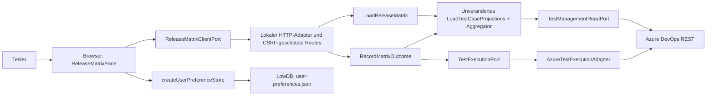

# Release-Matrix

Die verbindliche Funktionsreferenz ist der [freigegebene Vertrag v3](../contracts/release-matrix.v3.html). Diese technische Übersicht erweitert ihn nicht.

## Bedienung

Im bestehenden Set zur „Release-Matrix“ wechseln. Unter „Spalten & Gruppierung“ die Stammsuite als Testkatalog auswählen; ihr Unterbaum darf auch den gesamten Plan umfassen. Pro Spalte eine konkrete Versions-Suite auswählen. Ihr aktueller vollständiger Titel ist die Überschrift; eine Umbenennung verliert die gespeicherte ID nicht. Pfad und ID unterscheiden gleichnamige Versions-Suites. Die Spalten dürfen innerhalb desselben Plans außerhalb der Katalogbasis liegen.

Die feste Hierarchie lautet Version → Umgebung → Inhalt → direkte Testfälle. Eine logische Zeile besteht aus Umgebungsname, Inhaltsname und Testfall-ID. Diese Kombination erscheint über alle Katalogversionen einmal; abweichende Umgebungen oder Inhalte bleiben eigene Zeilen. Die Quelle wird ausschließlich unter der gewählten Version über exakt gleichnamige direkte Umgebungs- und Inhaltsknoten gesucht. Groß-/Kleinschreibung und der vollständige Name zählen. Suite-Tags, Query-Ausdrücke und Tag-Vererbung werden nicht verwendet.

Fehlende Quellpfade zeigen „?“, eine vorhandene Inhalts-Suite ohne direkte Testfall-Mitgliedschaft zeigt „·“. Mehrere gleiche direkte Pfade erfordern die konkrete Inhalts-Suite-Auswahl anhand Pfad/ID. Eine ungültige Auswahl wird nicht stillschweigend ersetzt. Ohne abgeschlossene Runs, aber mit vorhandenem Punkt, gilt der bestehende NotRun-Status „—“.

Die Gruppierung ist zwischen „Umgebung“ und „Inhalt“ umschaltbar; die jeweils andere Ebene steht als Zeilenkontext. Direkte Suite-Mitgliedschaft, vollständiger Testfall-Tag und Suche nach ID/Titel lassen sich kombinieren. Diese Filter bestimmen sichtbare Zeilen, ohne Spalten oder Quellen zu verändern. Konkrete Quellenpfade stehen in Konfiguration und Tooltip.

Status-Chips entsprechen der Zuordnung. Ein Klick öffnet die vollständige Outcome-Auswahl. Pfeiltasten wählen einen Wert, Enter bestätigt und Escape verwirft die Tastaturauswahl. Nur genau ein Testpunkt erlaubt das Schreiben. Nach der Auswahl entsteht ein neuer manueller Durchlauf; vorherige Resultate bleiben erhalten. Bei einem Fehler nach Erzeugung nennt die Meldung dessen ID. Der betroffene Punkt bleibt zunächst gesperrt; diesen Durchlauf in Azure prüfen. Ein später erfolgreich geladener Stand hebt genau diese Sperre auf, wenn die Projektion denselben physischen Punkt und den angelegten Run über ein Resultat oder den bestehenden Point-Fallback zuordnet, exakt den angeforderten Outcome bestätigt und dieser Run ausdrücklich den Status Completed besitzt. Zusätzlich muss ein rohes Resultat mit passender Run-, Testfall-, Punkt-ID und Outcome sowie gültigem Abschlussdatum vorliegen. Seine Suite-ID muss passen oder für den bestehenden Azure-Fallback fehlen. Beim Point-Fallback darf das Datum in der aggregierten Projektion fehlen; das Rohresultat muss den Abschluss weiterhin belegen. Ein abgeschlossenes Resultat oder ein Point-Fallback auf einen noch laufenden Run genügt nicht. Dabei wird kein Write wiederholt. Sperre und Meldung überstehen Ansichtswechsel, bleiben aber rein im Speicher.

„Matrix aktualisieren“ lädt den aktuellen Datenstand. Beim Wechsel zurück zur Zuordnung zeigt deren bestehende Aktualisierung denselben bestätigten Outcome.

Schlägt das Nachladen fehl, bleibt ein vorhandener Datenstand ausdrücklich als veraltet gekennzeichnet und für weitere Ergebnisänderungen gesperrt. Erst eine erfolgreiche Aktualisierung hebt die Sperre auf. Beim Ansichtswechsel bleiben laufende Verknüpfungsänderungen und ihre Rückmeldungen in der Zuordnung erhalten.

## C4: Container und Komponenten



- Domain: `matrix-config.ts` enthält Konfiguration, Sanitizing und erlaubte manuelle Outcomes. Der bestehende Outcome-Aggregator bleibt unverändert.
- Application: Der Matrix-Lader verwendet die bestehende Projektion je Testfall/Suite. Der vollständig geladene Baum liefert die Hierarchie. Fehlt eine Katalog-Suite im Baum, lehnt der Lader den Read als unvollständig ab. Ein Suite-Tag-Metadaten-Port ist nicht erforderlich; Work-Item-Hydration bleibt für Testfälle erhalten. `completedRunIds` übernimmt nur Completed-Runs aus der ohnehin gelesenen, pro Request zwischengespeicherten Run-Liste; dafür entsteht keine zusätzliche Azure-Abfrage. Fehlt dieses Feld, kann der Client einen unbestätigten Run nicht freigeben. `resultEvidence` bewahrt getrennt die Identitäten aus den ohnehin geladenen Rohresultaten. Nur Resultate für aktuell projizierte Run/Testfall-Paare werden übertragen; eine aus der Points-Liste ergänzte Projektions-ID ersetzt diesen Nachweis nicht. Auch dafür entstehen keine zusätzlichen Reads. Der Schreib-Use-Case validiert Mitgliedschaft und genau einen physischen Testpunkt, erzeugt einen Run, schließt Resultat und Run ab und prüft anschließend Run-ID, Resultat-ID, Outcome und Suite/Testfall über den vorhandenen Lesepfad.
- Adapter: Der neue Azure-Schreibadapter verwendet JSON für Test-Resultate/Runs. Relation-Patches behalten ihr bisheriges JSON-Patch-Format. Nicht-idempotente Run-Erzeugungen werden nicht automatisch wiederholt.
- HTTP: Die Route erfasst den Set-/Projektkontext einmal pro Anfrage. Schreibanfragen müssen zusätzlich den Kontext des geladenen Datenstands bestätigen; ein inzwischen geänderter Kontext wird vor dem Azure-Zugriff abgewiesen. Eine Sperre verhindert gleichzeitige Writes auf denselben Testpunkt im lokalen Server. Die Route beobachtet eine erfolgreiche Run-Erzeugung und meldet nachfolgende Fehler mit `MATRIX_RUN_UNCONFIRMED` und strukturiertem `details.runId`, ohne den bestehenden Schreib-Use-Case zu ändern. Der Browser unterscheidet dadurch unbestätigte Runs von Fehlern vor einer Erzeugung, ohne Meldungstexte auszuwerten.
- UI: Hooks verwalten flüchtigen Ladezustand; ein nach Set, Plan und Kontext getrennter In-Memory-Store erhält laufende Schreibvorgänge und deren Rückmeldungen über Ansichtswechsel hinweg. Bestätigte Änderungen lösen einen erneuten Lesevorgang aus. Darstellungsfunktionen bilden logische Zeilen aus dem Tupel von Umgebung, Inhalt und Testfall-ID. Die ausgewählte Ergebnisprojektion sowie Writes bleiben an die reale physische Suite und ihren Testpunkt gebunden.

## Persistenz

`setReleaseMatrices[setId]` speichert ausschließlich die Konfiguration. Der vorhandene Präferenzadapter übernimmt sanitisiertes, pro Set zusammengeführtes Speichern und Wiederherstellen. `localStorage` bleibt Fallback. Run-IDs, Ergebnisse, Fehlermeldungen und Pending-Zustände werden nicht als Nutzerpräferenz gespeichert.

Gruppenreihenfolge und Einklappzustände werden in `groupOrderByMode` und `collapsedByMode` jeweils getrennt für `environment` und `content` gespeichert. Gleiche Umgebungs- und Inhaltsnamen beeinflussen einander nicht.

Die Konfiguration trägt `version: 3`; Spalten speichern nur lokale ID, `versionSuiteId` und Sichtbarkeit. Beim Umstieg aus v2 (oder einem älteren Stand) bleiben Katalogbasis, Suche, Filter, Set und Azure-Kontext erhalten. Alte tagbasierte Spalten, physische Tag-Mappings und freie Tag-Gruppen samt ihren Zuständen werden zurückgesetzt. Ein Hinweis fordert die einmalige Auswahl konkreter Versions-Suites und des neuen Gruppierungsmodus. `migratedFrom` hält die Herkunft über mehrfaches server- und browserseitiges Sanitizing fest; bereits konfigurierte v3-Einstellungen werden bei weiteren Neustarts nicht erneut zurückgesetzt. Explizite Zuordnungen verwenden das Tupel von Umgebung, Inhalt und Spalten-ID als Schlüssel und die physische Inhalts-Suite-ID als Wert.

## Prüfung

```sh
node scripts/check-release-matrix-approval.mjs
npm run typecheck
npm run check:cycles
npm run test:coverage
npm run build
npm run test:e2e -- tests/e2e/release-matrix
```

Die 31 v3-Vertragsszenarien starten echten lokalen Server, Adapter und Browseroberfläche mit isoliertem LowDB-Verzeichnis. Azure-HTTP wird ausschließlich im Test-Harness simuliert; es gibt keine Writes in einem Azure-Kundenprojekt. Die eingefrorenen v1/v2-Szenarien bleiben historische Artefakte; ihre abgelöste Quellen- und Zeilenlogik ist nicht mehr die aktive Produktreferenz. Die zusätzliche Scrollregression bleibt aktiv. Unit-Tests prüfen unter anderem vollständige Hierarchie, logische Zeilen, direkte Quellpfade, getrennte Gruppenzustände, Zielvalidierung, Aggregator-Wiederverwendung und idempotente Präferenzmigration. Testdateien und Verträge werden über eingecheckte Prüfsummen validiert.

Das Coverage-Gate verlangt mindestens 80 Prozent für Zeilen, Statements und Funktionen. Ein Sonar-Rating wird durch dieses lokale Gate nicht gemessen.

## Diagnose lang laufender Matrix-Reads

Browserkonsole und lokales Server-Terminal protokollieren `[release-matrix.read]` mit derselben zufälligen `requestId` (Header `x-matrix-request-id`). Der Server übernimmt nur gültige UUID-v4-Werte; sonst erzeugt er selbst eine neue ID. Die Logs enthalten keine Testtitel, Ergebnisinhalte, URLs, Kontextnamen, Tokens oder Authentifizierungsheader.

- `start`: Request begonnen; `side` unterscheidet Browser und Server.
- `progress`: Plan-ID und Zähler, unter anderem `catalogSuiteCount`, `candidateRootCount`, `missingParentCount`, `duplicateCatalogSuiteIdCount`, `canonicalRootCount`, `skippedOverlappingRoots`, `overlappingSuiteCount`, `duplicateSuiteIdCount`, Suite-/Projektions-/Point-Anzahlen. `missingParentCount` zählt Katalogeinträge ohne im Katalog auflösbaren Elternverweis (einschließlich regulärer Roots).
- `pending`: alle zehn Sekunden Laufzeit, abgeschlossene/gestartete Operationen, gelesene Elementzahlen und höchstens fünf aktive Operationen mit numerischen Suite-/Run-IDs. Operationen: `catalog`, `tree`, `cases`, `points`, `runs`, `results`, `hydrate`, `http`. Suite-Tags werden seit v3 nicht mehr geladen.
- `http-response`: Nicht-2xx-Status plus vorhandene Suite-/Run-ID und numerisches `retryAfterMs`; höchstens fünf Meldungen je Status und Request. Statussummen bleiben im Fortschritt enthalten. So sind insbesondere Azure-Drosselung und anschließender Retry-Backoff erkennbar.
- `operation-error`: Fehlerkategorie und betroffene IDs, höchstens fünf Meldungen pro Request. Keine unbearbeiteten Exception-Texte.
- `complete`, `error` oder `aborted`: einmaliger Abschluss mit Gesamtlaufzeit und Zählern. Eine Navigation oder ein ersetztes Reload ist ein Abbruch, keine neue Benutzerfehlermeldung.

Beispiel einer laufenden Ergebnisabfrage (gekürzt):

```text
[release-matrix.read] { requestId: "b83911a1-1699-4c0e-a87b-903cb5d64c7c", side: "server", event: "pending", elapsedMs: 10000, activeCount: 1, active: [{ operation: "results", runId: 42, elapsedMs: 9800 }], counts: { runsCompleted: 1, resultsStarted: 8, resultsCompleted: 7 } }
```

Bei einer lange ladenden Matrix zuerst die gemeinsame Request-ID suchen und den letzten Fortschritt vergleichen: wartet der Browser auf einen Server-Read, läuft eine konkrete Suite-/Run-Abfrage, oder hat Azure einen Retry-After-Backoff vorgegeben? Eine React-Warnung über doppelte Schlüssel beweist für sich allein keinen Ladehänger; sie kann auch aus einer weiterhin gemounteten anderen Ansicht stammen.

Die Matrix löst Kandidaten aus dem flachen Suite-Katalog zunächst gegen die wirklichen Azure-Bäume auf. Überlappende Teilbäume werden vor der Aggregation entfernt; vollständige Pfade bleiben auch bei fehlenden Eltern-IDs und umgekehrter Katalogreihenfolge erhalten. Identische physische Suite-IDs erscheinen einmal, unterschiedliche Suites und Testpunkte bleiben getrennt. Gleiche Port-Reads und erfolgreiche GET-URLs werden ausschließlich innerhalb eines Matrix-Requests geteilt. Jeder neue Read beginnt ohne diese Caches; Schreibzugriffe und ihre Bestätigung verwenden keinen Matrix-Read-Cache. Die bestehende Ergebnisaggregation und die vollständige Historie bleiben erhalten. `runsItems: 0` erklärt fehlende Durchläufe, aber keinen fehlenden Hierarchiepfad: Bei vorhandener Mitgliedschaft und eindeutigem Punkt zeigt die Matrix NotRun.

Der Azure-Transport-Timeout (standardmäßig 60 Sekunden pro Aufruf) umfasst jetzt Authentifizierung, Fetch und Body. Timeout/Abbruch setzt ein echtes Fetch-AbortSignal; spät aufgelöste Authentifizierung darf danach keinen Request mehr starten. Navigation und ersetzte Browser-Reads brechen ihren Fetch ab; der Server beendet bei geschlossener Verbindung die Diagnose, bricht aktive Azure-GETs ab und verhindert weitere geplante Reads. Bereits laufende gemeinsame Azure-CLI-Authentifizierung sowie ein bereits begonnener Retry-Backoff-Sleep werden nicht separat beendet. Nach dessen Ende verhindert das Signal weitere Netzwerkaufrufe. Es gibt keine neuen automatischen Write-Retries und keine zusätzliche globale Gesamtlaufzeitgrenze oder gekürzte Paging-/Run-Historie.
